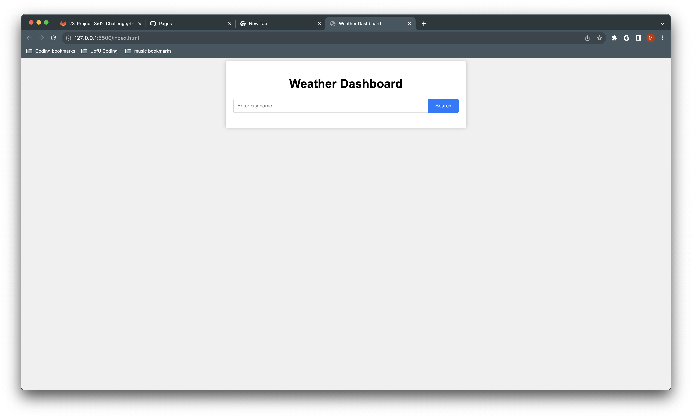
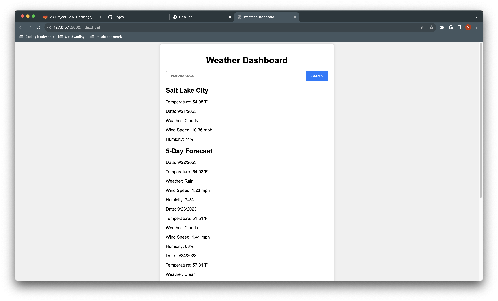
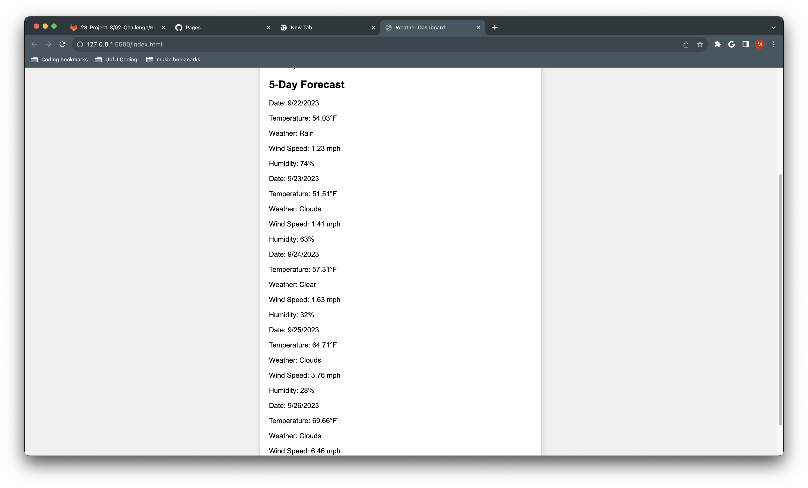

# Weather-App

## Description

This is a basic weather app that displays the 5 day weather forecast of any city via search

## Table of Contents

- [Installation](#installation)
- [Usage](#usage)
- [License](#license)
- [Contributing](#contributing)
- [Tests](#tests)
- [Questions](#questions)

## Installation

To install this application simply open the index.html 

## Usage

In order to use the app you just need to input a city into the search bar and press search and results will populate the page

## License

This application is covered under the None license.

## Contributing

N/A

## Tests

To test refer to usage instructions

## Questions

For additional questions, contact me:
- GitHub: [02madmax](https://github.com/02madmax)
- Email: maxlamthach10@gmail.com

## Links
Github Repo: https://github.com/02madmax/Weather-App
Deployed Applicaton: 

## Screenshots

